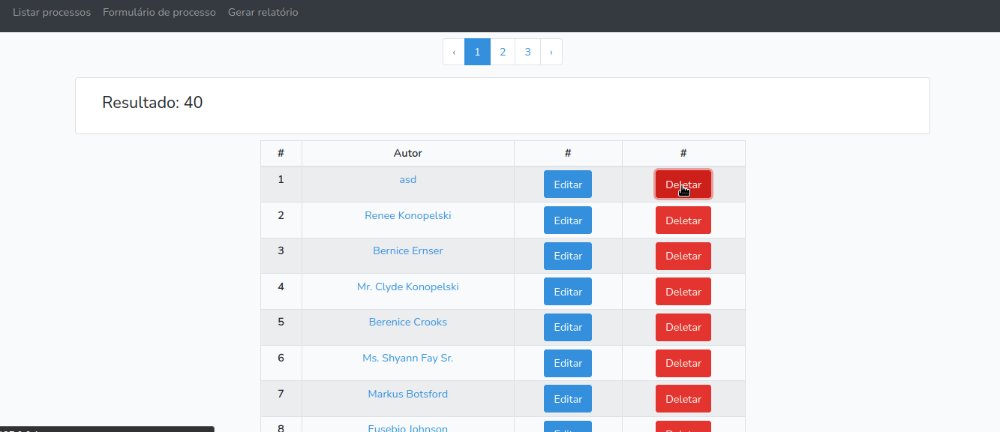

# Registrador de processo



## Requisitos

| PACOTE | VERSÃO |
| -----: | :----- |
| PHP | 7.4.3 |
| Composer | 1.10.1 |
| npm | 7.15.1 |
| Laravel | 7.0 |

## Como usar

- 1\. `git clone https://github.com/felippedesouza/registrador-de-processo-judicial.git`
- 2\. `cd registrador-de-processo-judicial`
- 3\. `npm install`
- 4\. `composer install`

- 5\. `mv .env.example .env` (**Nota:** coloque seu username e password configurados na sua maquina)
   ```env
   DB_CONNECTION=mysql
   DB_HOST=localhost
   DB_PORT=3306
   DB_DATABASE=registrador_de_processo_judicial
   DB_USERNAME=root
   DB_PASSWORD=
   ```

- 6\. `sudo systemctl start mysql`
- 7\. `sudo mysql -u root -p -e "source ./banco/comandos.sql"`
- 8\. `php artisan key:generate`
- 9\. `sudo php artisan migrate`
- 10\. `sudo php artisan tinker`
   - 10.1\. `factory(App\Models\Processo::class, 20)->create();`
   - 10.2\. `exit`
- 11\. `sudo php artisan serve`